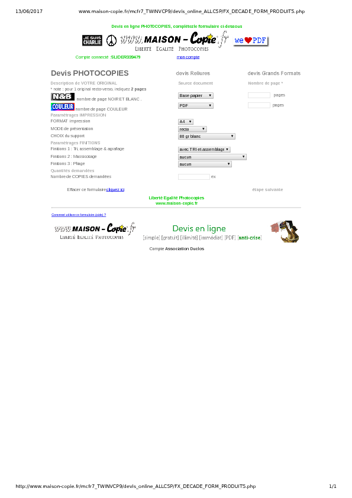
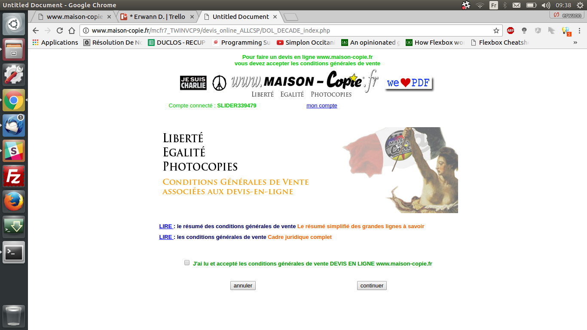
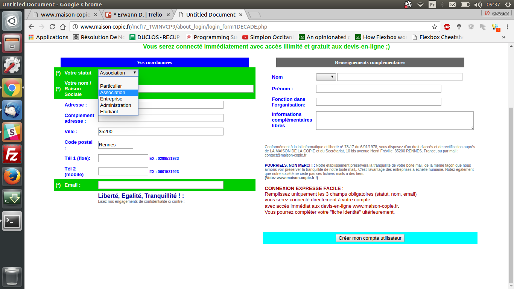
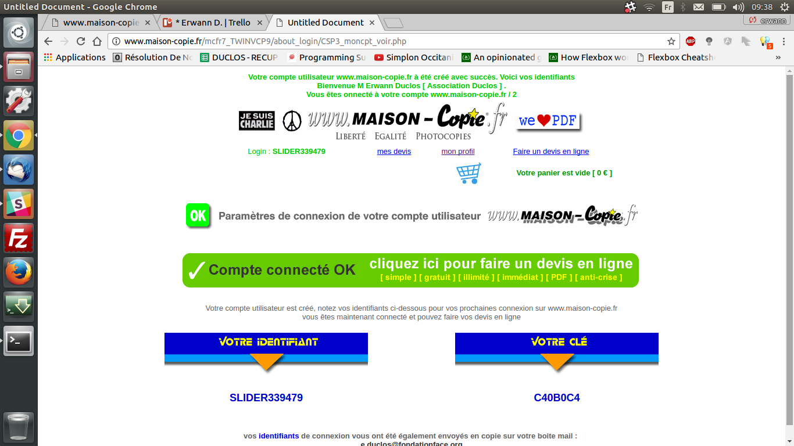

# Challenge du Mercredi

## Challenge #03
Un vrai client rennais, Maison de la Copie, aimerait que nous réimplémentions leur site. Etant donné que le client n'a aucun background technique initialement, il a réalisé son site sans respecter les "codes" du design. Son site ne respecte pas les bonnes pratiques et a besoin d'un bon rafraichissement.

Il est attendu à ce que vous réalisiez un site respectant les normes W3C, et que vous refassiez le design pour les pages suivants : 

Vous pouvez utiliser les technologies que vous voulez

Il est attendu de le rendre le Mardi 20 Juin au matin. 

